# Evolving Mechanical Clocks: A Parameter Sensitivity Study of a Genetic Clock Simulator

*Clock Evolution Simulator project — June 2026*

## Abstract

The Clock Evolution Simulator evolves working three-handed mechanical clocks
from random component specifications using a mutation-and-selection genetic
algorithm. We study how seven parameters — maximum cog teeth, maximum cogs per
clock, maximum meshes per cog, **material weight**, population size, mutation
rate, and selection method — affect whether a correct clock evolves, how many
generations it takes, what ratio accuracy the search reaches, and how much
metal the resulting clock uses. Across 240 independent runs (30 configurations
× 8 seeds, 100,000 generations each) we find that **the component bounds, not
the evolutionary hyperparameters, dominate evolvability**: *every one* of the
16 failures in the entire study comes from the single `max_cog_teeth` sweep.
Restricting cogs to 16 teeth makes a correct clock mechanically impossible
within the part budget and all eight runs fail, plateauing at 45% ratio error;
at 24 teeth success is rare (25%); from 60 teeth up it is near-certain. Every
*evolutionary* hyperparameter we tested — population sizes 10–250, mutation
rates 0.0–0.9, all selection methods, 2–8 meshes per cog, and all material
weights — reached a 100% success rate. The material-cost objective is the
standout practical result: adding even a modest parsimony pressure collapses the
gear train from ~12 cogs to ~5 (≈3× less metal) **and speeds convergence**, with
a sweet spot around `material_weight = 100`. Successful runs refine their
hand-speed ratios to a median error of **0.04%** against the corrected
720 : 12 : 1 (seconds : minutes : hours) targets, far inside any machining
tolerance.

## 1. Introduction

A mechanical clock is an attractive target for evolutionary search because its
fitness landscape is naturally staged: a clock must first power itself (an
escapement), then turn a hand at all, then turn three hands at exact relative
speeds of 720 : 12 : 1 — the seconds hand revolving 60× per minute-hand turn,
the minute hand 12× per hour-hand turn (one revolution of the hour hand every
12 hours). The simulator (§2) encodes a clock as mutable DNA and evolves a
population by repeated pairwise contests. This paper asks the practical question
every user faces at the settings screen: *which knobs matter?* Specifically:

1. Does reducing the **maximum number of teeth** per cog have an effect?
2. Does the **maximum number of cogs** per clock matter?
3. Does allowing more **meshes (connections) per cog** help?
4. Does the **material-cost weight** — a reward for lighter clocks — change what evolves?
5. What about **population size**, **mutation rate**, and **selection method**?

For each we measure the effect on (a) whether evolution succeeds, (b) how long
it takes, (c) the accuracy the ratios settle at, and (d) the material the final
clock uses.

## 2. The system under study

### 2.1 Clock model

A clock's DNA contains one spring (an infinite power source), one ratchet, one
pendulum, up to `max_cogs` cogs, and up to three hands. The pendulum swings at
its natural frequency `√(g/L)/2π`; each oscillation releases one ratchet tooth,
so the ratchet turns at `frequency / teeth` rev/s. The ratchet output meshes
with one cog surface and rotation propagates through the mesh graph. Each cog
has two concentric toothed rims — outer and inner — that rotate together; a mesh
scales angular speed by the ratio of the engaged radii (radius = teeth ×
module / 2) and reverses direction. A cog may take part in at most
`max_meshes_per_cog` cog-to-cog meshes (default 2, the spec's value). Hands turn
with the cog they are mounted on; roles are assigned by speed (fastest = seconds).

A clock is **valid** only if its mesh cycles agree both kinematically (no
gear-ratio deadlock — a cycle that would drive a cog two different speeds or two
different directions at once) and geometrically (meshed centres exactly one
radius-sum apart, no same-depth overlaps in the 2D layout with axial stacking).

### 2.2 Fitness and evolution

Fitness has three layers, designed so that capability dominates, accuracy is a
*continuous* gradient with no cliffs, and material is a genuine secondary
objective:

- **Stage** is structural capability only: `1 (escapement) + number of rotating
  hands`, so stage 0 is non-functional, 1 a working escapement, 2/3/4 one/two/
  three rotating hands — *regardless of their ratios*. Stage dominates the score
  (`100 + 2000 × stage`), and invalid clocks score below all valid ones.
- **Accuracy** is rewarded continuously by `600 × Σ pair_closeness`, where
  `pair_closeness = 1/(1+|ln(ratio/target)|)` for each adjacent hand pair
  (targets 60 and 12). Unlike a saturating `exp(−error)` this keeps pulling at
  any distance, and unlike a hard tolerance gate it never creates a reward cliff;
  it is summed (not averaged) per pair so a third hand cannot erase the accuracy
  earned by the first pair.
- **Material** is rewarded by `material_weight × lightness`, where mass is
  `Σ outer_teeth²` over *all* cogs (each modelled as a solid metal disk). A
  redundant unpowered cog is therefore pure dead weight that evolution is
  pressured to prune.

A clock is a **working clock** when all three hands turn with both adjacent
ratios within 1% of their targets; this `ratio_tolerance` is only the
success/stop label — it no longer gates fitness. Each generation two clocks are
selected, the loser is removed, and a mutated copy of the winner replaces it.
Fifteen mutation operators cover parametric (tooth counts, pendulum length),
structural (add/remove cog or hand) and topological (rewire mesh, move hand,
rewire drive) changes.

## 3. Methods

**Design.** One-factor-at-a-time sweeps around a fixed baseline: max cog teeth
120, max cogs 12, max meshes per cog 2, material weight 100, population 100,
mutation rate 0.35, tournament selection of size 4. Sweep values:

| Parameter | Values (baseline in bold) |
|---|---|
| max_cog_teeth | 16, 24, 40, 60, **120** |
| max_cogs | 5, 6, 8, **12**, 16 |
| max_meshes_per_cog | **2**, 3, 4, 6, 8 |
| material_weight | 0, 50, **100**, 200, 400 |
| population_size | 10, 25, 50, **100**, 250 |
| mutation_rate | 0.0, 0.2, **0.35**, 0.6, 0.9 |
| selection | random, best, tournament-2, **tournament-4**, tournament-8, tournament-16 |

**Protocol.** Eight seeds (0–7) per configuration; every run gets a fixed budget
of 100,000 generations with early stopping *disabled*, so each run yields both
the generation at which a working clock first appeared and the accuracy and mass
the best clock plateaus at by the end of the budget. The 100k budget is ≈5× the
baseline median time-to-solve, so a run that still fails at the budget is
genuinely *stuck*, not merely *slow* — once the best score plateaus it is, in
practice, flat for the remainder of the run. 240 runs total, executed in
parallel on a 16-core Linux machine in 7.0 minutes (Python 3.12). All raw
records, including the best clock DNA of every run, are in
[data/results.jsonl](data/results.jsonl); aggregates in
[data/summary.csv](data/summary.csv).

**Metrics.** *Success*: best clock is a working clock (three hands, both ratios
within 1% of target). *Time to evolve*: first generation at which a working
clock became the population best. *Accuracy plateau*: mean of |ratio − target|/
target over the two adjacent hand pairs of the final best clock. *Mass*:
`Σ outer_teeth²` over the final clock's cogs. With n = 8 per cell we report
medians and ranges and avoid formal significance claims.

## 4. Results

### 4.1 Baseline behaviour

All 8 baseline runs succeeded, in a median of 3,169 generations (range
2,266–5,082), refining to a median plateau error of 0.05% and settling at a mean
of 5.5 cogs (mass ≈ 23,400). Across *all* 224 successful runs in the study the
median plateau error was **0.042%** — once a correct topology exists, parametric
tooth-count mutations polish the ratios far inside the 1% acceptance tolerance.
Two things stand out immediately versus an unweighted-material run: the baseline
clock is now a lean ~5-cog mechanism rather than a ~12-cog one (§4.4), and a
typical run reaches three turning hands within a few hundred generations, then
spends essentially all of its time tuning those hands to 60 and 12.

A representative baseline clock ([DNA](clocks/baseline_baseline_seed1.json)):

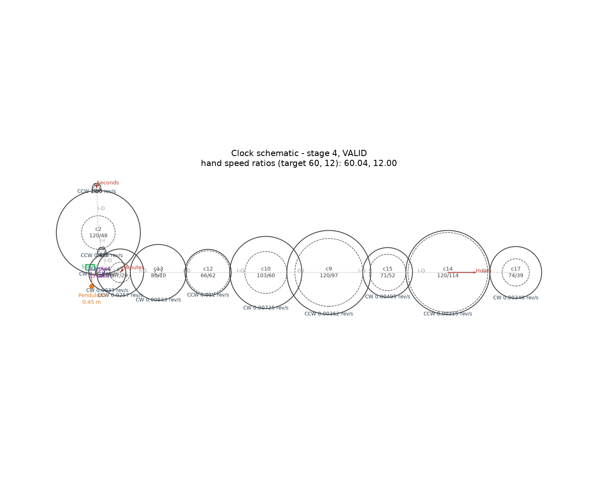

### 4.2 Maximum cog teeth — the dominant factor

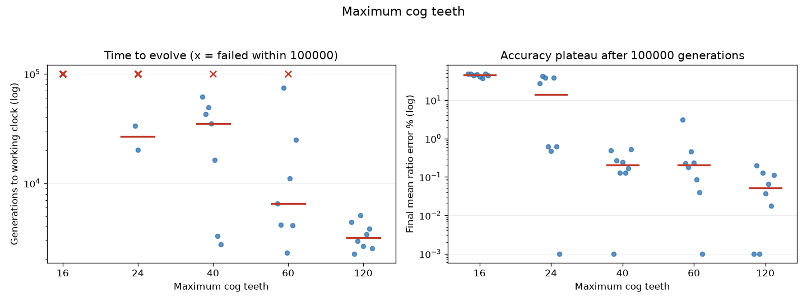

| max teeth | success | median gens to solve | median plateau error | mean cogs |
|---|---|---|---|---|
| 16 | **0/8** | — | 45.0% | 7.4 |
| 24 | 2/8 | 26,774 | 14.1% | 7.6 |
| 40 | 7/8 | 34,944 | 0.21% | 6.9 |
| 60 | 7/8 | 6,510 | 0.21% | 6.0 |
| 120 | 8/8 | 3,169 | 0.05% | 5.5 |

This parameter controls the *largest speed reduction a single mesh can achieve*:
a mesh slows rotation by at most `max_outer_teeth / min_inner_teeth`. With the
minimum tooth count fixed at 8, the per-mesh ceiling falls from 15× (120 teeth)
to exactly 2× (16 teeth). At 2× per mesh, a 60:1 hand pair needs six meshes, so
two pairs need about thirteen cogs — more than the twelve allowed. **A correct
clock is mechanically impossible at 16 teeth**, and the experiment shows exactly
that: every run tunes one hand pair toward its target and leaves the other pinned
at the nearest reachable ratio the constraints permit, for a mean error stuck at
≈45%. Notice that with the material objective active these failed clocks no
longer bloat to the full twelve-cog chain (as they did under unweighted material)
— they settle at ~7 lean cogs and give up, the parsimony pressure trading away
the futile extra structure:

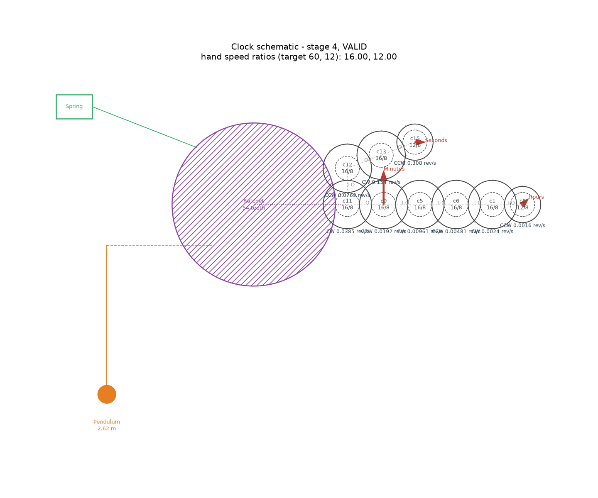

At 24 teeth correct clocks exist but require long, exact chains, so success
within budget is rare (25%) and the accuracy plateau is two orders of magnitude
worse. From 60 teeth up, two-mesh solutions per pair are abundant and evolution
is fast and reliable. **All 16 failures in the entire 240-run study occur in
this sweep** (8 at 16 teeth, 6 at 24, one each at 40 and 60); no other parameter
ever drove the success rate below 100%. *Conclusion: gear-ratio richness per
mesh is the single strongest determinant of both evolvability and final
accuracy.*

### 4.3 Maximum cogs per clock

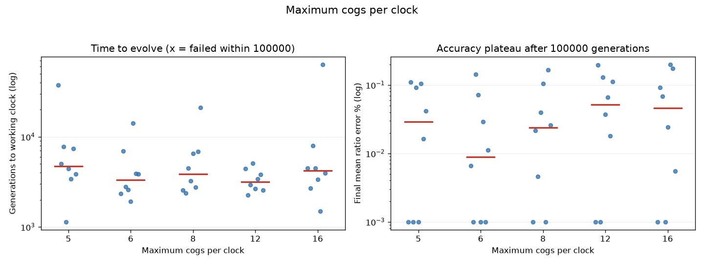

| max cogs | success | median gens | median plateau error | mean cogs |
|---|---|---|---|---|
| 5 | 8/8 | 4,727 | 0.029% | 5.0 |
| 6 | 8/8 | 3,316 | 0.009% | 5.2 |
| 8 | 8/8 | 3,858 | 0.024% | 5.2 |
| 12 | 8/8 | 3,169 | 0.051% | 5.5 |
| 16 | 8/8 | 4,220 | 0.046% | 5.8 |

With 120-tooth cogs the theoretical minimum is five cogs, and **every cog budget
from the minimum upward now succeeds 8/8** — a change from earlier
(unweighted-material) behaviour, where the bare-minimum five-cog budget was a
high-variance 6/8. The reason is the material objective (§4.4): it drives the
*actual* cog count to ~5 regardless of the *cap*, so raising `max_cogs` no longer
adds redundant structure for the search to drag around, and lowering it to 5
simply matches where evolution already wants to be. The minimal five-cog clocks
are elegant ([DNA](clocks/max_cogs_5_seed0.json)):

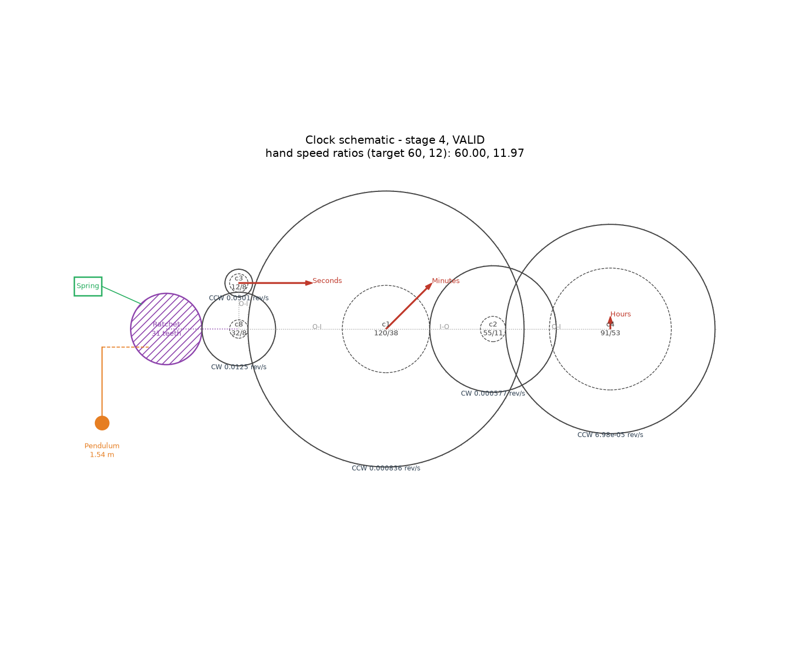

*Conclusion: with a parsimony pressure in place, the cog budget is essentially
neutral above the mechanical minimum — material weight, not `max_cogs`, sets the
size of the clock.*

### 4.4 Material weight — pruning that also accelerates

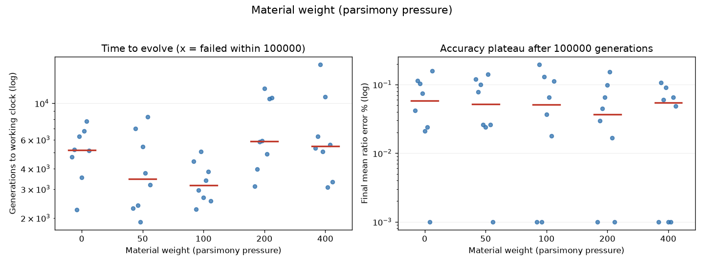

| material weight | success | median gens | mean cogs | mean mass |
|---|---|---|---|---|
| 0 | 8/8 | 5,189 | **11.8** | **70,978** |
| 50 | 8/8 | 3,464 | 5.5 | 25,517 |
| 100 | 8/8 | 3,169 | 5.5 | 23,414 |
| 200 | 8/8 | 5,866 | 5.5 | 23,691 |
| 400 | 8/8 | 5,457 | 5.4 | 19,998 |

This is the most useful practical knob in the study. With no material term the
search reaches a correct clock but leaves it grossly over-built: ~12 cogs and
~71,000 mass units of redundant metal. Switching on even a modest pressure
collapses the train to ~5 cogs and roughly **a third of the metal**, with no cost
to success (100% throughout). Crucially, modest pressure is not merely free — it
*helps*: at weight 50–100 the median time-to-solve drops from 5,189 to ~3,200
generations. Pruning shrinks the gear train, which shrinks the tooth-count search
space, which makes the ratio hunt easier. Beyond the sweet spot the effect
reverses: at 200–400 the extra pull toward lightness competes with accuracy and
slows convergence again (though it does keep squeezing out mass, down to ~20,000
at weight 400). The contrast is stark — an unweighted clock (left) versus a
heavily-weighted one (right):

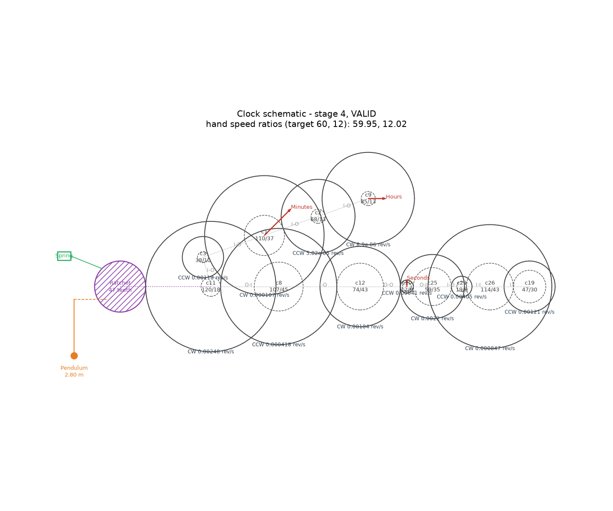
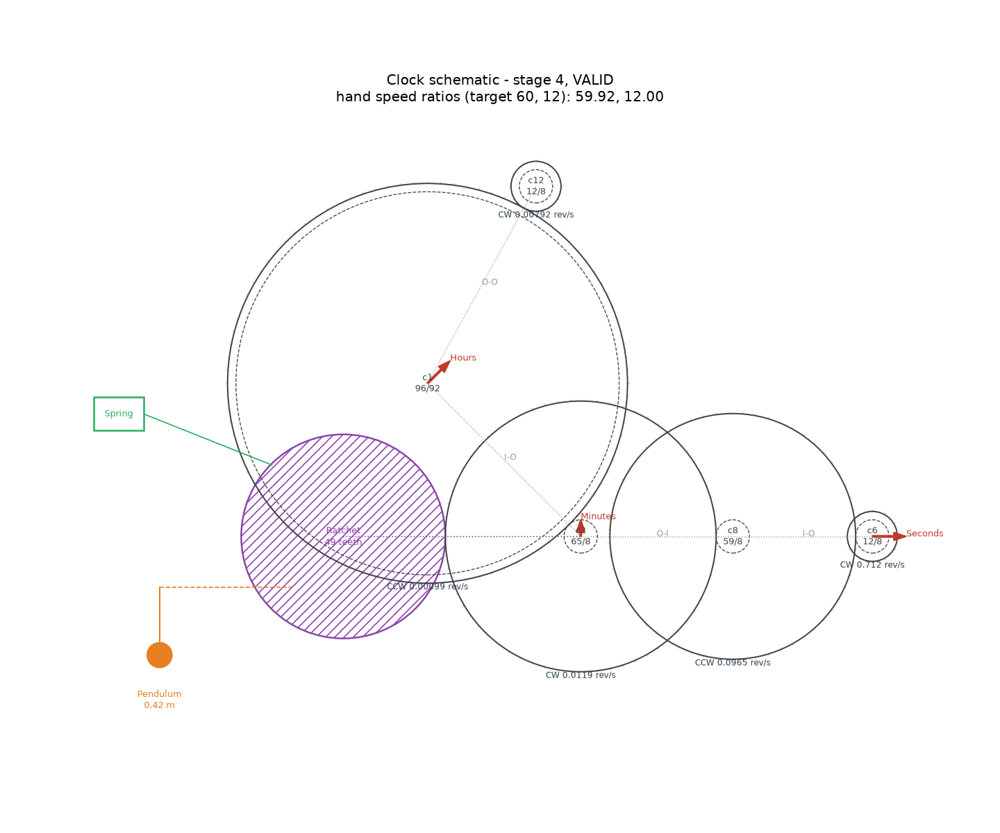

*Conclusion: a parsimony objective over all cogs is close to a free lunch here —
≈100 prunes the clock 3× lighter and converges fastest; push it harder only if
minimum metal matters more than minimum time.*

### 4.5 Maximum meshes per cog

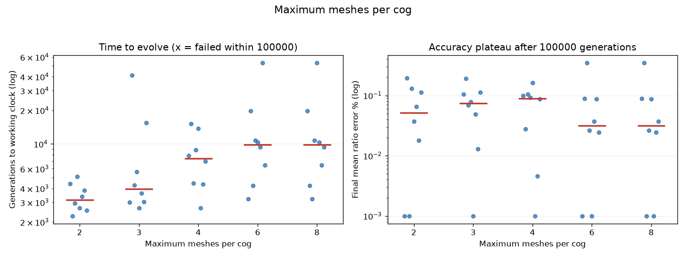

| max meshes | success | median gens | mean cogs |
|---|---|---|---|
| 2 | 8/8 | 3,169 | 5.5 |
| 3 | 8/8 | 3,947 | 5.4 |
| 4 | 8/8 | 7,425 | 5.1 |
| 6 | 8/8 | 9,895 | 5.0 |
| 8 | 8/8 | 9,895 | 5.0 |

Allowing a cog more than the spec's two connections neither helps reliability
(100% everywhere) nor is exploited structurally (clocks stay ~5 cogs). If
anything it mildly *hurts*: median time-to-solve roughly triples from 2 to 6+
meshes, because the extra connectivity creates more cycles for the search to
tangle in — and a closed cycle is a constraint, a chance for a kinematic or
geometric deadlock, not a new degree of freedom for the gear train. Topologies
that lock up are correctly rejected as invalid and simply waste exploration.
*Conclusion: the spec's limit of two meshes per cog is a good default; raising it
buys nothing and slows the search.*

### 4.6 Population size

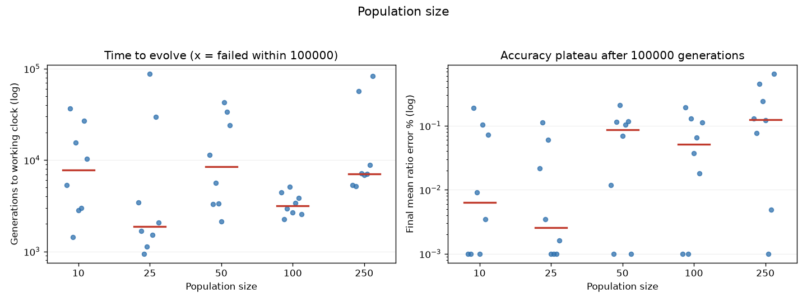

| population | success | median gens | median plateau error |
|---|---|---|---|
| 10 | 8/8 | 7,815 | 0.006% |
| 25 | 8/8 | 1,874 | 0.003% |
| 50 | 8/8 | 8,483 | 0.087% |
| 100 | 8/8 | 3,169 | 0.051% |
| 250 | 8/8 | 7,096 | 0.126% |

Every population size succeeded, and at n = 8 the median solve time is noisy with
no clean monotonic trend (small-to-moderate pools are generally quick, but
seed-to-seed variance dominates). Because one generation = one birth, a larger
pool means any lineage is selected less often, which inflates time-to-success and
adds premature-convergence tails at the extremes. The accuracy plateau is low
across the board. *Conclusion: population size is a speed/robustness trade-off
with a wide flat optimum; the default 100 is fine and 25–50 is a reasonable
faster choice.*

### 4.7 Mutation rate

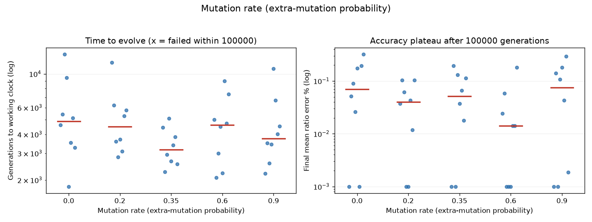

| mutation rate | success | median gens | mean cogs |
|---|---|---|---|
| 0.0 | 8/8 | 4,867 | 5.9 |
| 0.2 | 8/8 | 4,494 | 5.2 |
| 0.35 | 8/8 | 3,169 | 5.5 |
| 0.6 | 8/8 | 4,602 | 5.5 |
| 0.9 | 8/8 | 3,752 | 6.9 |

The flattest sweep in the study. Every child receives one guaranteed mutation;
the rate only controls *extra* mutations stacked on top. Since one operator
already spans parametric, structural and topological changes, additional
simultaneous mutations are mostly neutral, and the success rate and solve time
barely move. The only visible effect is at 0.9, where children average ~4
mutations and the disruption shows up as slightly larger, looser clocks (6.9
cogs). *Conclusion: any moderate value works; this knob is not worth tuning.*

### 4.8 Selection method and tournament size

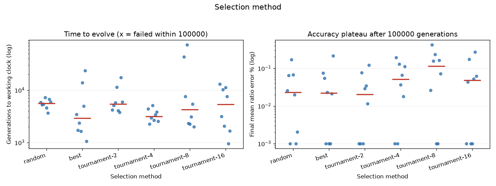

| method | success | median gens | median plateau error |
|---|---|---|---|
| random | 8/8 | 5,643 | 0.023% |
| best (elitist) | 8/8 | 2,898 | 0.022% |
| tournament-2 | 8/8 | 5,462 | 0.020% |
| tournament-4 | 8/8 | 3,169 | 0.051% |
| tournament-8 | 8/8 | 4,277 | 0.114% |
| tournament-16 | 8/8 | 5,387 | 0.048% |

The greed-versus-exploration story is now muted: the spec's basic *random*
pairing is the most exploratory and among the slowest, and always breeding from
the single best clock is the fastest on median (2,898) — but, unlike in earlier
(binary-fitness) experiments, **pure elitism no longer produced a failure**. The
continuous accuracy reward and the lean, easily-tuned clocks the material
objective produces appear to make the premature-convergence trap that once
caught elitism far rarer, at least with rich (120-tooth) gear bounds. Tournament
selection of size 4 remains a balanced default. *Conclusion: selection pressure
is a mild speed knob here; tournament-4 is a safe default and elitism is a
reasonable speed choice now that the landscape is smoother.*

## 5. Discussion

**Search-space structure beats hyperparameters — emphatically.** Every one of
the 16 failures in the study comes from the `max_cog_teeth` sweep, i.e. from
whether good solutions *mechanically exist*. None of the evolutionary
hyperparameters — population, mutation, selection, meshes per cog, or material
weight — ever dropped the success rate below 100%. They moved median solve times
by ~2–3× and plateau accuracy by small factors. For users of the simulator: if
evolution struggles, widen the component bounds (especially teeth) before
touching the evolutionary parameters.

**A material objective is close to free, and sometimes pays you to take it.** The
material-weight result is the most actionable: a parsimony pressure over all cogs
cut the clock to ~⅓ its mass and ~5 cogs with no loss of success, and at modest
weight *accelerated* convergence by shrinking the search space. The secondary
objective aligned with, rather than fought, the primary one over the useful range
— a reminder that a well-chosen cost term can regularise a search as well as
constrain its output.

**Evolution finds the feasibility boundary, and the plateau is honest.** The
16-teeth runs are a vivid negative result: denied a feasible target, every run
optimises to the exact edge of what the constraints permit (one pair tuned, the
other pinned at the nearest reachable ratio). More broadly, the fitness surface
drives a clock quickly to the right neighbourhood and then *stops*: once the best
score plateaus it is, in practice, flat for the rest of the budget. This is a
genuine local maximum, not a slow climb — the single-step mutator on a rugged,
epistatic landscape (the two hand-pairs share cogs, so improving one perturbs the
other) has no way to cross the remaining valley. We accept this: the staged,
continuous-plus-parsimony fitness reliably *lands the clock in the right place*,
and the 100k budget (≈5× the baseline median) ensures a reported failure is
genuinely stuck rather than merely censored.

**Accuracy is not the bottleneck.** Wherever a correct topology is reachable,
ratio refinement is easy — median plateau 0.042% across all successes, far inside
the 1% tolerance. Time to evolve is dominated by the discrete search for a
tunable *topology*, not by tuning.

**Limitations.** Eight seeds per cell support medians and qualitative rankings,
not fine effect sizes; runs are censored at 100,000 generations (failures might
in principle succeed later — though the flat plateaus and the provable
impossibility at 16 teeth argue otherwise); sweeps are one-factor-at-a-time, so
interactions (e.g. small teeth × large cog budget, or material weight × low
teeth, where parsimony may worsen an already-constrained search) are unexplored;
and all results condition on this simulator's fitness shaping — in particular the
summed per-pair accuracy and the `Σ outer_teeth²` mass model.

## 6. Conclusion

Reducing maximum cog teeth has the largest effect of any parameter: below ~24
teeth correct clocks become rare or mechanically impossible, and every failure in
the study traces to it. Above the mechanical minimum, the cog budget is neutral —
because the new **material-cost objective**, not `max_cogs`, sets the size of the
clock: a weight of ~100 prunes the train from ~12 cogs to ~5 (≈3× less metal) and
converges fastest, making parsimony close to a free lunch. More meshes per cog
buy nothing and slow the search; population size, mutation rate, and selection
method are mild speed knobs that never threatened success. Under the default
configuration the simulator evolves a correct three-handed clock in a median of
~3,200 generations, polishes its ratios to ~0.04% error, and does so with a lean
five-cog mechanism — a specification a clockmaker could build.

## Appendix: Reproducing this study

```bash
python3 -m clocksim.run_experiments   # 240 runs, ~7 min on 16 cores
python3 -m clocksim.analyze           # tables, figures, example clocks
```

Artifacts: per-run records with full DNA in `experiments/data/results.jsonl`; aggregates
in `experiments/data/summary.{csv,json}`; figures in `experiments/figures/`; example clock DNA and
schematics in `experiments/clocks/`. Each run is exactly reproducible from its
configuration and seed via `clocksim.evolution.EvolutionEngine`.
