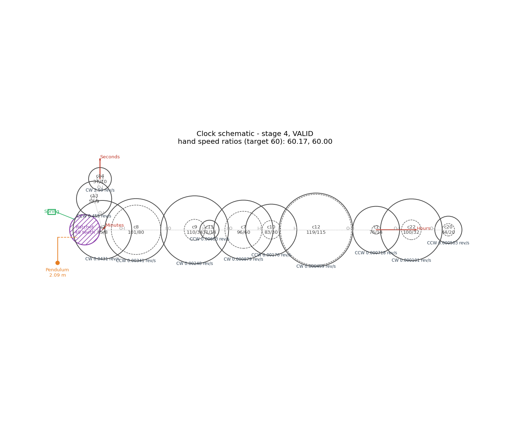
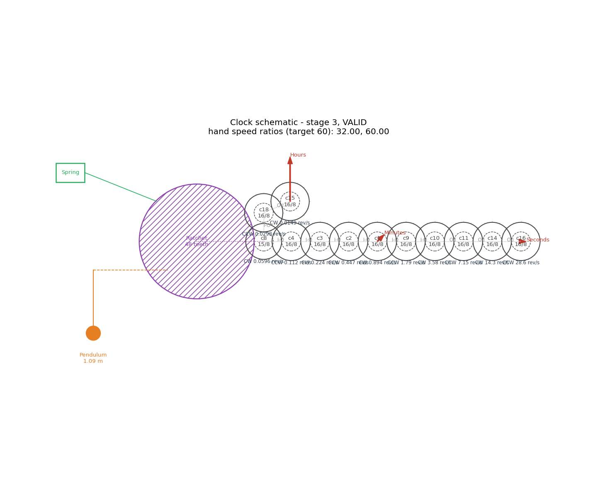
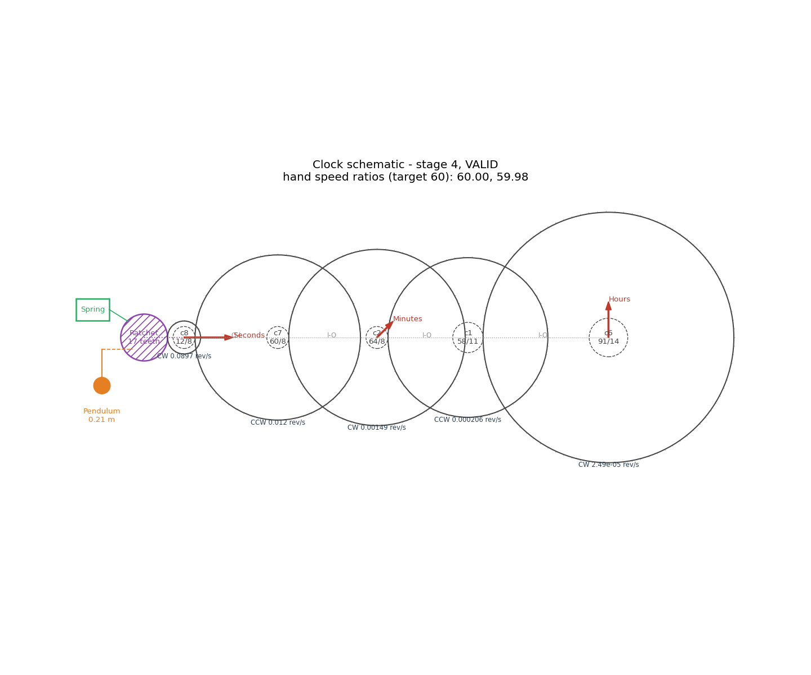

# Evolving Mechanical Clocks: A Parameter Sensitivity Study of a Genetic Clock Simulator

*Clock Evolution Simulator project — June 2026*

## Abstract

The Clock Evolution Simulator evolves working three-handed mechanical clocks
from random component specifications using a mutation-and-selection genetic
algorithm. We study how five parameters — maximum cog teeth, maximum cogs per
clock, population size, mutation rate, and selection method — affect whether a
correct clock evolves, how many generations it takes, and what ratio accuracy
the search ultimately reaches. Across 176 independent runs (22 configurations
× 8 seeds, 50,000 generations each) we find that **the component bounds, not
the evolutionary hyperparameters, dominate evolvability**. Restricting cogs to
16 teeth makes a correct clock mechanically impossible within the part budget
and every run fails, plateauing at 46.7% ratio error; at 24 teeth success is
possible but rare (37.5%); from 60 teeth upward it is nearly certain. Every
evolutionary hyperparameter setting we tested — population sizes 10–250,
mutation rates 0.0–0.9, all selection methods — achieved a 100% success rate,
with one telling exception: purely elitist ("best") selection was the fastest
on median but produced the only failure, a premature-convergence trap.
Successful runs refine their hand-speed ratios to a median error of **0.09%**
against the 60:1 targets, two orders of magnitude inside machining tolerance.

## 1. Introduction

A mechanical clock is an attractive target for evolutionary search because its
fitness landscape is naturally staged: a clock must first power itself (an
escapement), then turn a hand at all, then turn three hands at exact relative
speeds of 3600 : 60 : 1. The simulator (described in §2) encodes a clock as
mutable DNA and evolves a population by repeated pairwise contests. This paper
asks the practical question every user of the simulator faces at the settings
screen: *which knobs matter?* Specifically:

1. Does reducing the **maximum number of teeth** per cog have an effect?
2. Does the **maximum number of cogs** per clock matter?
3. What about **population size**?
4. What about **mutation rate**?
5. What about the **selection method and tournament size**?

For each we measure the effect on (a) whether evolution succeeds, (b) how long
it takes, and (c) the accuracy level the ratios settle at.

## 2. The system under study

### 2.1 Clock model

A clock's DNA contains one spring (an infinite power source), one ratchet, one
pendulum, up to `max_cogs` cogs, and up to three hands. The pendulum swings at
its natural frequency `√(g/L)/2π`; each oscillation releases one ratchet
tooth, so the ratchet turns at `frequency / teeth` rev/s. The ratchet output
meshes with one cog surface and rotation propagates through the mesh graph.
Each cog has two concentric toothed rims — outer and inner — that rotate
together; a mesh scales angular speed by the ratio of the engaged radii
(radius = teeth × module / 2) and reverses direction. A cog may take part in
at most two cog-to-cog meshes. Hands turn with the cog they are mounted on;
roles are assigned by speed (fastest = seconds).

A clock is **valid** only if its mesh cycles agree both kinematically (no
gear-ratio deadlock) and geometrically (meshed centres exactly one radius-sum
apart, no same-depth overlaps in the 2D layout with axial stacking).

### 2.2 Fitness and evolution

Fitness is hierarchical: stage 0 (non-functional), 1 (working escapement), 2
(one rotating hand), 3 (two or more), 4 (three hands, both adjacent ratios
within 1% of 60:1). Stage dominates the score; within a stage, bonuses reward
powered cogs, mounted hands, each rotating hand, and per-pair ratio accuracy
`exp(−|ln(ratio/60)|)`, summed over pairs. Each generation two clocks are
selected, the loser is removed, and a mutated copy of the winner replaces it.
Fifteen mutation operators cover parametric (tooth counts, pendulum length),
structural (add/remove cog or hand) and topological (rewire mesh, move hand,
rewire drive) changes.

## 3. Methods

**Design.** One-factor-at-a-time sweeps around a fixed baseline: max cog teeth
120, max cogs 12, population 100, mutation rate 0.35, tournament selection of
size 4. Sweep values:

| Parameter | Values (baseline in bold) |
|---|---|
| max_cog_teeth | 16, 24, 40, 60, **120** |
| max_cogs | 5, 6, 8, **12**, 16 |
| population_size | 10, 25, 50, **100**, 250 |
| mutation_rate | 0.0, 0.2, **0.35**, 0.6, 0.9 |
| selection | random, best, tournament-2, **tournament-4**, tournament-8, tournament-16 |

**Protocol.** Eight seeds (0–7) per configuration; every run gets a fixed
budget of 50,000 generations with early stopping *disabled*, so each run
yields both the generation at which stage 4 was first reached and the accuracy
the best clock plateaus at by the end of the budget. 176 runs total, executed
in parallel on a 16-core Linux machine in 4.8 minutes (Python 3.8). All raw
records, including the best clock DNA of every run, are in
[data/results.jsonl](data/results.jsonl); aggregates in
[data/summary.csv](data/summary.csv).

**Metrics.** *Success*: best clock at stage 4 (three hands, both ratios within
1% of 60). *Time to evolve*: first generation at which a stage-4 clock became
the population best (stage dominates fitness, so this is also the first
generation one existed). *Accuracy plateau*: mean of |ratio − 60|/60 over the
two adjacent hand pairs of the final best clock. With n = 8 per cell we report
medians and ranges and avoid formal significance claims.

## 4. Results

### 4.1 Baseline behaviour

All 8 baseline runs succeeded, in a median of 3,921 generations (range
2,595–7,985), then refined to a median plateau error of 0.15% (range
0.04–0.46%). A typical run reaches stage 3 within a few hundred generations;
most of the time to stage 4 is spent waiting for a topology whose third hand
can be tuned to 60:1. Across *all* 155 successful runs in the study the median
plateau error was **0.089%** — once a correct topology exists, parametric
tooth-count mutations reliably polish the ratios far inside the 1% acceptance
tolerance, and improvement continues for the rest of the budget.

A representative baseline clock ([DNA](clocks/baseline_baseline_seed6.json)):



### 4.2 Maximum cog teeth — the dominant factor


| max teeth | success | median gens to stage 4 | median plateau error |
|---|---|---|---|
| 16 | **0/8** | — | 46.7% |
| 24 | 3/8 | 8,498 | 0.94% |
| 40 | 4/8 | 6,494 | 0.52% |
| 60 | 7/8 | 4,424 | 0.17% |
| 120 | 8/8 | 3,921 | 0.15% |

This parameter controls the *largest speed reduction a single mesh can
achieve*: a mesh slows rotation by at most `max_outer_teeth / min_inner_teeth`.
With the minimum tooth count fixed at 8, the per-mesh ceiling falls from 15×
(120 teeth) to exactly 2× (16 teeth). At 2× per mesh, a 60:1 hand pair needs
six meshes, so two pairs need about thirteen cogs — more than the twelve
allowed. **A correct clock is mechanically impossible at 16 teeth**, and the
experiment shows exactly that: every run builds a maximal twelve-cog chain
of near-identical 16/8 cogs, tunes *one* hand pair to ≈60, and leaves the other
stuck at a power of two (32:1 in the example below), for a mean error pinned
at |32−60|/60 ≈ 46.7%. Evolution finds the boundary of the reachable design
space and parks on it:



At 24–40 teeth correct clocks exist but require long, exact chains, so success
within 50,000 generations becomes a coin flip and the accuracy plateau is an
order of magnitude worse. From 60 teeth up, two-mesh solutions per pair
(e.g. 7.5 × 8) are abundant and evolution is fast and reliable. *Conclusion:
gear-ratio richness per mesh is the single strongest determinant of both
evolvability and final accuracy.*

### 4.3 Maximum cogs per clock


| max cogs | success | median gens | median plateau error | mean run time |
|---|---|---|---|---|
| 5 | 6/8 | 6,744 | 0.10% | 12.0 s |
| 6 | 8/8 | 13,381 | 0.01% | 13.4 s |
| 8 | 8/8 | 3,618 | 0.09% | 17.5 s |
| 12 | 8/8 | 3,921 | 0.15% | 22.5 s |
| 16 | 8/8 | 4,596 | 0.22% | 30.3 s |

With 120-tooth cogs the theoretical minimum is five cogs (two meshes per 60:1
pair, sharing the chain). At exactly that minimum, evolution succeeds 6/8
times but slowly and with high variance — there is essentially one viable
topology and the search must find it precisely. The successful minimal clocks
are elegant: the example below hits 60.00 and 59.98 with five cogs
([DNA](clocks/max_cogs_5_seed6.json)).



Six cogs was the slowest median in the study (13,381 generations, one seed
needing 45,260) — barely-sufficient budgets create a long topology hunt.
From eight cogs the search is fast and flat; beyond twelve, more parts buy
nothing except a ~35% slower simulation (bigger clocks cost more to evaluate)
and slightly sloppier plateaus (more redundant structure to drag around).
*Conclusion: give evolution a margin of 1.5–2× the minimal part count; more
than that only wastes compute.*

### 4.4 Population size


| population | success | median gens | median plateau error |
|---|---|---|---|
| 10 | 8/8 | 2,269 | 0.08% |
| 25 | 8/8 | 2,048 | 0.14% |
| 50 | 8/8 | 2,979 | 0.12% |
| 100 | 8/8 | 3,921 | 0.15% |
| 250 | 8/8 | 6,557 | 0.08% |

Every population size succeeded. Because one generation = one birth, a larger
pool simply means any given lineage is selected less often, so time-to-success
grows with population size (sub-linearly: 25× more clocks cost only ~3× more
generations). Small populations are fastest on median but carry a premature-
convergence tail — pop 10's worst seed took 23,327 generations, ten times its
median, after the whole pool fixated on a hard-to-fix topology. The accuracy
plateau is essentially independent of population size. *Conclusion: population
size trades speed against robustness; the default 100 is conservative, and
25–50 would be a reasonable faster default.*

### 4.5 Mutation rate


| mutation rate | success | median gens | median plateau error |
|---|---|---|---|
| 0.0 | 8/8 | 4,206 | 0.08% |
| 0.2 | 8/8 | 5,141 | 0.21% |
| 0.35 | 8/8 | 3,921 | 0.15% |
| 0.6 | 8/8 | 4,117 | 0.06% |
| 0.9 | 8/8 | 5,647 | 0.11% |

The flattest sweep in the study. In this simulator every child receives one
guaranteed mutation; the rate only controls *extra* mutations stacked on top.
Since a single operator already spans parametric, structural and topological
changes, additional simultaneous mutations are mostly neutral — slightly
helpful for escaping plateaus, slightly harmful for preserving good builds —
and the effects nearly cancel. Only at 0.9 (children average ~4 mutations)
does the disruption cost show as a ~40% slower median. *Conclusion: any
moderate value works; this knob is not worth tuning.*

### 4.6 Selection method and tournament size


| method | success | median gens | median plateau error |
|---|---|---|---|
| random | 8/8 | 6,402 | 0.09% |
| best (elitist) | **7/8** | 3,123 | 0.06% |
| tournament-2 | 8/8 | 5,076 | 0.07% |
| tournament-4 | 8/8 | 3,921 | 0.15% |
| tournament-8 | 8/8 | 3,172 | 0.04% |
| tournament-16 | 8/8 | 4,033 | 0.11% |

A clean greed-versus-reliability story. The spec's basic *random* pairing is
the most exploratory and the slowest (median 6,402). Always breeding from the
single best clock is the fastest on median (3,123) **and produced the study's
only hyperparameter-induced failure**: one seed converged the entire
population onto a stage-3 design with ratios 59.97 : 2.03 — one pair perfect,
the other unfixable without a structural rebuild that elitism never allowed
to survive — and stayed trapped for all 50,000 generations after its 33rd
improvement. Tournament selection buys nearly all of elitism's speed without
the trap: size 8 matched it (median 3,172, 8/8 success) and recorded the best
accuracy plateau of the study (0.04%). Very large tournaments (16) drift back
toward elitist behaviour, showing heavier slow tails (one seed at 33,086).
*Conclusion: tournament selection with size 4–8 is the right default; pure
elitism is a measurably risky speed hack.*

## 5. Discussion

**Search-space structure beats hyperparameters.** The only settings that ever
drove the success rate below 100% were the *mechanical* bounds — teeth and
cog budget — i.e. whether good solutions exist and how densely the design
space is populated with them. The classic GA knobs moved median solve times
by at most ~2× and the plateau accuracy by small factors. For users of the
simulator: if evolution struggles, widen the component bounds before touching
the evolutionary parameters.

**Evolution finds the feasibility boundary.** The 16-teeth runs are a vivid
negative result: denied a feasible target, every run independently discovered
the same maximal-chain architecture and optimized to the exact edge of what
the constraints permit (one perfect pair, one pair at the best reachable
power of two). Staged fitness with within-stage gradients made the impossible
configurations fail *gracefully and informatively* rather than randomly.

**Accuracy is not the bottleneck.** Wherever a correct topology is reachable,
ratio refinement is easy: medians of 0.04–0.22% error, far inside the 1%
acceptance tolerance, with fine ±1-tooth mutations doing the polishing. Time
to evolve is dominated by the discrete search for a tunable *topology*, not
by tuning.

**Limitations.** Eight seeds per cell support medians and qualitative
rankings, not fine effect sizes; runs are censored at 50,000 generations
(failures might succeed later — the teeth-16 case provably cannot); sweeps
are one-factor-at-a-time, so interactions (e.g. small teeth × large cog
budget, where extra cogs should partly rescue small ratios) are unexplored;
and all results condition on this simulator's fitness shaping, in particular
the summed per-pair accuracy bonus that removes the two-perfect-hands local
optimum.

## 6. Conclusion

Reducing maximum cog teeth has the largest effect of any parameter: below ~24
teeth correct clocks become rare or mechanically impossible, and final
accuracy degrades by orders of magnitude. The cog budget matters near its
minimum (five) and is otherwise neutral-to-slightly-negative. Population
size trades median speed for worst-case robustness. Mutation rate barely
matters. Selection pressure shows a real exploitation–exploration trade-off:
elitism is fast but caused the only avoidable failure, while tournament
selection (size 4–8) was uniformly reliable, fast, and the most accurate.
Under the default configuration the simulator evolves a correct three-handed
clock in a median of ~4,000 generations and polishes its ratios to ~0.1%
error — a specification a clockmaker could build.

## Appendix: Reproducing this study

```bash
python3 -m clocksim.run_experiments   # 176 runs, ~5 min on 16 cores
python3 -m clocksim.analyze           # tables, figures, example clocks
```

Artifacts: per-run records with full DNA in `experiments/data/results.jsonl`; aggregates
in `experiments/data/summary.{csv,json}`; figures in `experiments/figures/`; example clock DNA and
schematics in `experiments/clocks/`. Each run is exactly reproducible from its
configuration and seed via `clocksim.evolution.EvolutionEngine`.
